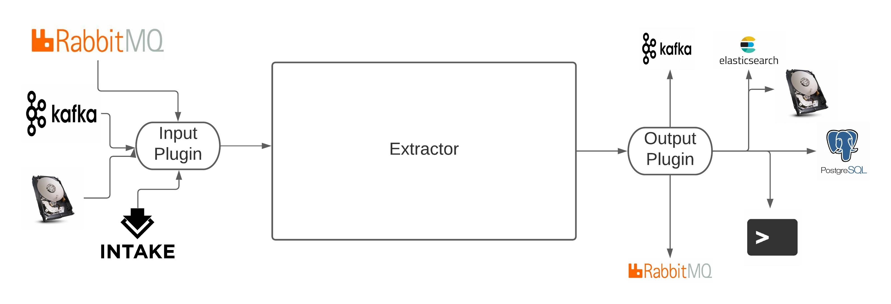

**************
Asset Scanner
**************

:fa:`github` `View on Github <https://github.com/cedadev/asset-scanner>`_

The asset scanner provides the framework and access to shared tools. The framework
allows you to build extractors to get metadata from file objects using plugins to
change the source of the files, the output of the metadata and the processing chain
which extracts the metadata. The framework leverages a modular, plugin architecture
to allow users to modify the workflow to fit their needs.

The process expects a stream of "assets" (an asset being a file, zarr object, etc.).
The source of this stream is configured with `input plugins <asset_scanner/input_plugins>`_
which could be as simple as listing directories on a file system or using message
queues as part of a complex ingest system. The `extractors <extractors>`_ operate on this stream and
pass to `output plugins <asset_scanner/output_plugins>`_. The output is at the level
of an "asset" so higher level aggregated objects may require an aggregation step.

These outputs are also configurable so could dump to the terminal (for debugging), file,
a data store (postgres, elasticsearch, etc.) or even a message queue for onward processing.

The framework was constructed to extract metadata for creating STAC catalogs
but could be used to extract metadata for any faceted search system.

What is STAC?
==============

The SpatioTemporal Asset Catalog (`STAC <https://stacspec.org/>`_) specification provides a common language to
describe a range of geospatial information, so it can more easily be indexed and discovered.
A "spatiotemporal asset" is any file that represents information about the earth captured
in a certain space and time.

Generators
==========

The different packages are designed to extract different types and levels of metadata.

.. list-table::
    :header-rows: 1

    * - Name
      - Description
    * - :ref:`Asset Generator <asset_generator/index:asset generator>`
      - The asset generator is focused on asset level metadata (name, location, size, etc.)
    * - :ref:`Item Generator <item_generator/index:item generator>`
      - The item generator takes the stream of assets and runs a workflow, defined by :ref:`item descriptions <item_descriptions/item_descriptions:item descriptions>` , to extract facets.
        The output of this is still at the asset level so some aggregation may be needed.
        Using upserts, `elasticsearch <https://www.elastic.co/guide/en/elasticsearch/reference/current/docs-update.html>`_
        performs this aggregation for you.

.. toctree::
   :maxdepth: 3
   :caption: Contents:

   asset_scanner/index
   asset_generator/index
   item_generator/index
   item_descriptions/item_descriptions

.. toctree::
   :maxdepth: 2
   :caption: API:

   api/asset_scanner/asset_scanner_api
   api/asset_generator/api
   api/item_generator/item_generator_api

Indices and tables
==================

* :ref:`genindex`
* :ref:`modindex`
* :ref:`search`
